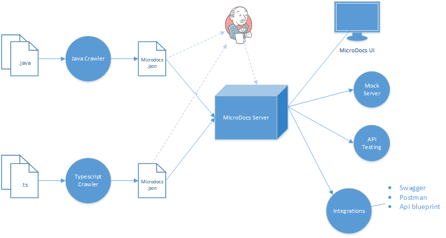

[](https://travis-ci.org/MaxxtonGroup/microdocs)
#  MicroDocs

This tool keeps your api documentation in one place organised. Multiple project can be stored in groups and you can keep track of different versions. MicroDocs uses an extended version of the OpenApi specifications, which adds definitions for dependencies between projects. So breaking changes in the REST API between two project can be detected. MicroDocs can become a key part in your Continuous Integration/Deployment infrastructure, thanks to the integration with many tools

Full documentation can be found at [microdocs.io](http://microdocs.io)

## MicroDocs Flow


1. Generate Microdocs definitions from Java or TypeScript source files.
2. Upload those definitions to the MicroDocs server using the Crawlers, Jenkins or the RestApi.
3. The MicroDocs server organise all the definitions and do some compatibility checks.
4. Explore project definitions using the Microdocs UI
5. Preforme Api tests and setup a Mock server.
6. Integrate with many other tools with Swagger, Postman and Api Blueprint.

## Setup
MicroDocs consists out of crawlers, server, ui and integrations tools.
**Crawlers** generates definitions from the source code of a project.
These definitions are then published at the MicroDocs server.
The **server** then checks for compatibility problems and aggregate the result.
The **ui** or other **integration tools** request the result through the RestApi of the server.

### Setup MicroDocs Server
The MicroDocs server is available on [Docker Hub](https://hub.docker.com/r/maxxton/microdocs/).
To install via Docker run:
```
$ docker run --name microdocs -v /some/data/folder:/microdocs/microdocs-server/data -p 3000:3000 -d maxxton/microdocs
```

### Build the MicroDocs Docker image
```
docker build --no-cache --build-arg=CLI_VERSION='2.0.0' --build-arg NPM_TOKEN={yourtoken} .
```
Where yourtoken can be generated as a base64 encoded string of the username and password:
```
echo -n 'user:pass' | openssl base64
```

### Setup Crawlers
Crawlers are project and framework specific. Currently only the Spring framework is supported. 
The setup for each Crawler can be found in their subdirectories

### Setup Integrations tools
Integrations tools have their own setup. They can be found in their subdirectories

## Features
* **User interface**
    * Overview of all projects with their dependencies
    * RestAPI definitions
    * Show compatibility problems
* **Server**
    * Follows the [Open Api specifications](https://openapis.org/specification) with some additions
    * Central place to store all project definitions
    * Versioning support
    * RestAPI for many integrations
    * Easy setup through Docker
* **Crawlers**
    * Generate definitions from projects
    * Crawl projects at build time
    * Plugin for gradle projects
    * Currently only Spring applications are supported
* **Integrations**
    * Jenkins plugin
        * Publish new definitions to the MicroDocs server
        * Check for compatibility problems
        * Report back on a pull request in BitBucket/Stash
    * Gradle plugin
        * Generate definitions from projects
        * Publish new definitions to the MicroDocs server
        * Check for compatibility problems
    * Kubernetes (coming soon...)
    * Api testing (coming soon...)
    * Mock server (coming soon...)
    * [Swagger integrations](http://swagger.io/open-source-integrations/)
    * [Api Blueprint integrations](https://apiblueprint.org/tools.html)
